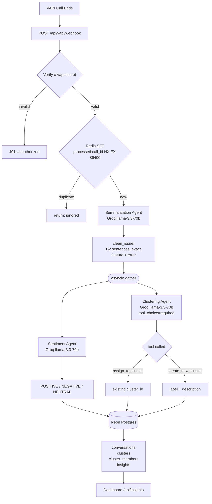
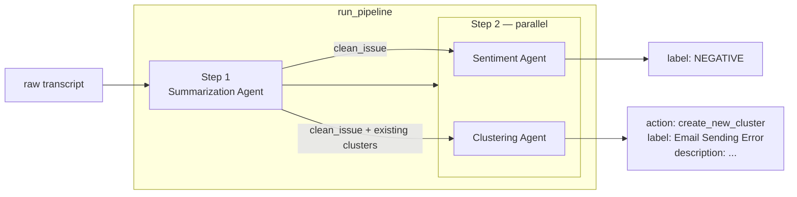
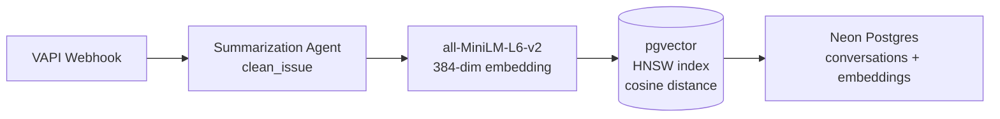
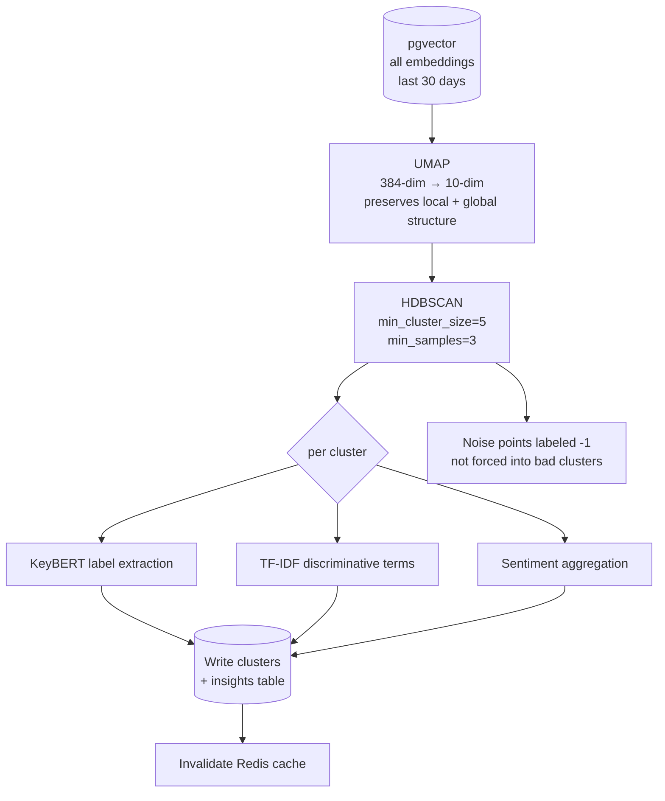
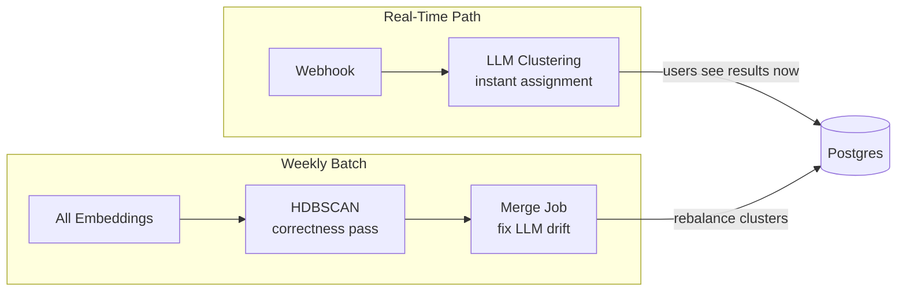

# Agnost Signals — Reasoning & Design Decisions

## Try It

| | |
|---|---|
| **Dashboard** | https://agnost-ai.vercel.app |
| **VAPI Phone** | +1 (319) 719-9242 — call, describe an agent issue, watch the cluster appear live |
| **Backend API** | `https://agnost-backend-37579330977.us-central1.run.app` |
| **GitHub** | https://github.com/dranzer-17/AgnostAI |

---

## About Me

**Location:** Mumbai — open to relocating to Bangalore or San Francisco

**Stipend expectation:** $1,000/month

**Role:** Internship for now — happy to convert to full-time if it's a fit for both sides

**Earliest start date:** June 15th (no notice period)

**Open-source:** Fixed flaws in the test eval pipeline of [Omega Memory](https://github.com/dranzer-17/omega-memory/commit/48f1f57407cc01067669ecc05b404a4b01c79f00) — a memory layer for AI agents. The eval suite had edge cases that let bad memory retrievals pass silently.

---

## Top 3 Agent Productivity Hacks

**1. Claude + Cursor as a team, not a tool**
Claude is more accurate and reasons better; Cursor is fast and stays in the editor flow. I run them simultaneously — Claude as the senior engineer thinking through architecture and edge cases, Cursor as the fast hands executing the well-defined subtasks. One big engineer + 3-4 interns.

**2. Skills and MCP connectors, not raw chat**
Most people use Claude as a chat box and get frustrated when it doesn't deliver. Claude Skills and MCP servers (for filesystem, APIs, databases) are what unlock real output. A Claude that can read your codebase, query your DB, and call your APIs is a different tool entirely.

**3. 70% planning, 30% coding**
I spend most of my time ideating, designing the architecture, and deciding which tools to use — before writing a single line. That upfront clarity is where I have the most leverage. Once the design is locked, Claude + Cursor handles the coding while I observe and steer.

---

## Hot Take

> Developers who just write code will become largely obsolete — only ~30% will remain relevant. The ones who survive are those who ideate, architect, and design systems. The SDE role is slowly shifting: AI writes the code and manages workflows, humans supervise and set direction. The leverage is moving upstream — from implementation to design.

---

---

## What Was Built

A real-time voice analytics engine that ingests VAPI end-of-call webhooks, extracts the user's core problem via LLM, clusters it by intent, runs sentiment analysis, and surfaces results on a PM dashboard.

---

## Approach 1 (Shipped): Agentic + Redis

### Why This Over HDBSCAN First

HDBSCAN requires a corpus before it produces meaningful clusters — it can't cluster a single conversation. The agentic approach produces a named, described cluster on call #1. Given a weekend, real data flowing end-to-end immediately was the right call.

### End-to-End Flow

### Multi-Agent Pipeline

### Key Decisions

**Why Groq over local RoBERTa/transformers**

RoBERTa was the original sentiment model. Replaced because:
- 500MB model + torch loaded on every cold start (30s+)
- Python 3.12 had PyO3/pydantic-core incompatibility
- 2GB of ML dependencies in the Docker image

Groq llama-3.3-70b handles summarization + sentiment + clustering in three parallel calls for ~$0.001/webhook. Faster, smaller image, zero cold start penalty.

**Why tool calls for clustering**

`tool_choice="required"` forces structured JSON output (label, description, cluster_id) — no parsing hacks. The tool schema carries constraints directly to the model.

**Why Redis for dedup (not DB unique constraint)**

Redis `SET NX` rejects duplicates before any LLM call, saving 3 Groq API calls per duplicate. O(1) vs a full DB round-trip + index lookup.

**Why Neon Postgres over MongoDB**

Insights require SQL aggregations — `AVG(frustration)`, `COUNT(*) GROUP BY cluster`, join across three tables. Document store adds nothing here.

### Alternatives Rejected

| Option | Reason Rejected |
|---|---|
| Cosine similarity threshold only | "Can't log in" and "password reset loop" are close in embedding space but different problems |
| Single LLM call (all tasks) | Mixed tasks degrade output quality; harder to isolate failures |
| Sequential sentiment → clustering | Adds ~800ms for zero benefit — they're independent |
| Pinecone | Third paid service; pgvector + HNSW handles <1M vectors fine |

---

## Approach 2 (With a Month): Embeddings + HDBSCAN

The agentic approach has one structural weakness: **LLM drift**. At 10k+ conversations, the clustering agent accumulates fragmentation — semantically identical problems land in different clusters because prompt phrasing drifted. The fix is to ground clustering in geometry, not language.

### Ingest + Embedding Pipeline

### Nightly Batch Clustering

### Why UMAP Before HDBSCAN

HDBSCAN degrades in high dimensions (curse of dimensionality — distance metrics lose meaning above ~50 dims). UMAP reduces 384-dim embeddings to 10-dim while preserving cluster structure. Without it, HDBSCAN either finds one giant cluster or all noise.

### Why HDBSCAN Over K-Means / DBSCAN

| Algorithm | Problem |
|---|---|
| K-Means | Requires K upfront — you don't know how many intent clusters exist |
| DBSCAN | Single epsilon parameter struggles with variable-density clusters |
| HDBSCAN | No K needed, handles variable density, labels noise as -1 instead of forcing bad assignments |

### Hybrid: LLM Real-Time + HDBSCAN Weekly

The LLM assigns new conversations instantly. HDBSCAN runs weekly to fix accumulated drift — merging fragmented clusters, splitting incorrectly merged ones, rebuilding centroids from ground truth embeddings.

### What Else Would Change With a Month

| Area | Weekend | Month |
|---|---|---|
| Clustering | LLM only | LLM real-time + HDBSCAN weekly |
| Embeddings | None | all-MiniLM-L6-v2 + pgvector HNSW |
| Frustration index | Rule-based heuristics | Fine-tuned classifier on labeled calls |
| Multi-tenancy | Single org | `org_id` on every table + Postgres RLS |
| Dashboard | Manual refresh | SSE live updates + 7-day trend lines |
| Streaming | End-of-call only | Mid-call frustration detection via Whisper timestamps |
| Embedding drift | None | `model_version` tracking, re-embed on model update |

---

## Stack Summary

| Layer | Choice | Reason |
|---|---|---|
| LLM | Groq llama-3.3-70b | Fast, cheap, handles 3 tasks in parallel |
| Summarization | Groq agent | Forces specificity (feature + error behavior) before clustering |
| Clustering | Agentic tool calls | Works on call #1, no corpus needed |
| Sentiment | Groq agent | Same model, no extra dependencies |
| Dedup | Redis SET NX | O(1), rejects before LLM calls |
| Database | Neon Postgres | SQL aggregations + future pgvector embeddings in one place |
| Backend | FastAPI on Cloud Run | Scales to zero, no idle cost |
| Frontend | Next.js on Vercel | Zero config deploy |
